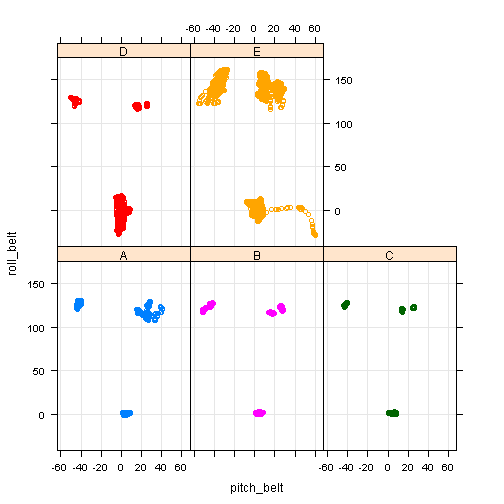
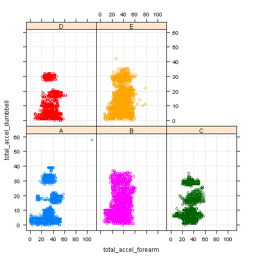
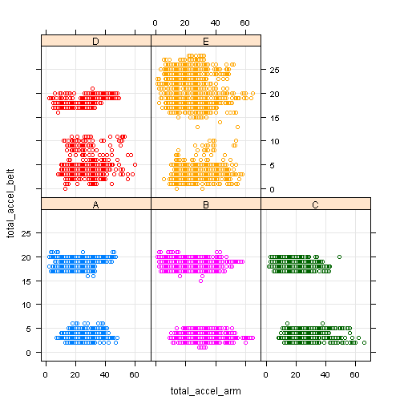

# Prediction Assignment


```r
library(ggplot2) ; library(caret) ; library(randomForest)
```

## Overview

In this assignment, we are asked to look at data on weight lifting and build a prediction model. The data came be found at [http://groupware.les.inf.puc-rio.br/har](http://groupware.les.inf.puc-rio.br/har).

## Reading and Processing the Data

We start by reading in the data, select a subset of the variables available, and take 70% of the data to be our training data and leave 30% of the data to be our testing data, reserved for cross validation.


```r
workout <- read.csv("pml-training.csv")

predictors <- grep("(^roll_)|(^pitch_)|(^yaw_)|(^total_accel_)|(^gyros_)|
                   (^accel_)|(^magnet_)", names(workout), value = TRUE )
predictorsExt <- c("user_name", predictors, "classe")

subwork <- workout[,predictorsExt]
inTrain <- createDataPartition(y = subwork$classe, p = 0.7, list = FALSE)
training <- subwork[inTrain,]
testing <- subwork[-inTrain,]
```

## Looking at the Data

We plot various variables against each other and hope to observe how the different type of exercises distribute themselves within the data ("classe"):


```r
xyplot(roll_belt ~ pitch_belt | classe, training, grid = TRUE, group = classe)
```

 

```r
xyplot(total_accel_dumbbell ~ total_accel_forearm | classe, training, grid = TRUE, group = classe)
```

 

```r
xyplot(total_accel_belt ~ total_accel_arm | classe, training, grid = TRUE, group = classe)
```

 

We note that some exercises have more cases than other data, but that we do in fact observe the different exercises clumping into groups.

## Analysis

Having looked at various plots and observed distinct patterns in the different exercises, we choose to build a model from using the randomForest package which is meant for "[classification and regression based on a forest of trees using random inputs](http://cran.r-project.org/web/packages/randomForest/index.html)."


```r
set.seed(1)
modFit <- randomForest(training[,-15], y = training$classe)
```

We list the confusion matrix for this model on the training data below:


```r
predictedTrain <- predict(modFit, training)
confusionMatrix(predictedTrain, training$classe)
```

```
## Confusion Matrix and Statistics
## 
##           Reference
## Prediction    A    B    C    D    E
##          A 3906    0    0    0    0
##          B    0 2658    0    0    0
##          C    0    0 2396    0    0
##          D    0    0    0 2252    0
##          E    0    0    0    0 2525
## 
## Overall Statistics
##                                 
##                Accuracy : 1     
##                  95% CI : (1, 1)
##     No Information Rate : 0.284 
##     P-Value [Acc > NIR] : <2e-16
##                                 
##                   Kappa : 1     
##  Mcnemar's Test P-Value : NA    
## 
## Statistics by Class:
## 
##                      Class: A Class: B Class: C Class: D Class: E
## Sensitivity             1.000    1.000    1.000    1.000    1.000
## Specificity             1.000    1.000    1.000    1.000    1.000
## Pos Pred Value          1.000    1.000    1.000    1.000    1.000
## Neg Pred Value          1.000    1.000    1.000    1.000    1.000
## Prevalence              0.284    0.193    0.174    0.164    0.184
## Detection Rate          0.284    0.193    0.174    0.164    0.184
## Detection Prevalence    0.284    0.193    0.174    0.164    0.184
## Balanced Accuracy       1.000    1.000    1.000    1.000    1.000
```

As our model is capable of predicting the training data with 100% accuracy. We decide to move forward with the model and see how it holds up against the testing data.


```r
predictedTest <- predict(modFit, testing)
confusionMatrix(predictedTest, testing$classe)
```

```
## Confusion Matrix and Statistics
## 
##           Reference
## Prediction    A    B    C    D    E
##          A 1674    0    0    0    0
##          B    0 1139    0    0    0
##          C    0    0 1026    0    0
##          D    0    0    0  964    0
##          E    0    0    0    0 1082
## 
## Overall Statistics
##                                     
##                Accuracy : 1         
##                  95% CI : (0.999, 1)
##     No Information Rate : 0.284     
##     P-Value [Acc > NIR] : <2e-16    
##                                     
##                   Kappa : 1         
##  Mcnemar's Test P-Value : NA        
## 
## Statistics by Class:
## 
##                      Class: A Class: B Class: C Class: D Class: E
## Sensitivity             1.000    1.000    1.000    1.000    1.000
## Specificity             1.000    1.000    1.000    1.000    1.000
## Pos Pred Value          1.000    1.000    1.000    1.000    1.000
## Neg Pred Value          1.000    1.000    1.000    1.000    1.000
## Prevalence              0.284    0.194    0.174    0.164    0.184
## Detection Rate          0.284    0.194    0.174    0.164    0.184
## Detection Prevalence    0.284    0.194    0.174    0.164    0.184
## Balanced Accuracy       1.000    1.000    1.000    1.000    1.000
```

## Result

Having applied the model to testing data, we find that the model is able to predict the testing data with 100% accuracy. We are also provided with a 95% confidence interval of (0.99937, 1). As such, we expect an out of sample error of less than 0.1%.
